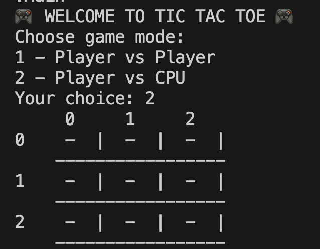
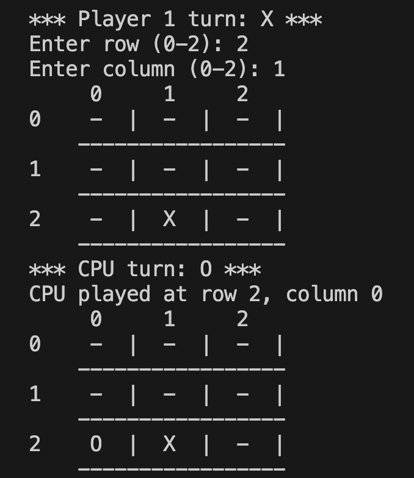

# Tic Tac Toe — Java Console Application

## Project Description

This project is a **Tic Tac Toe (Tres en Raya)** game developed entirely in **Java**, designed to run in the **terminal**.

It supports two players (**X** and **O**) who take turns placing their moves on a **3×3** board. The program validates each move, updates the board after every turn, checks for win or draw conditions, and displays the final result.

The goal of this project is to apply core programming fundamentals, practice object-oriented design, and strengthen collaborative development workflows using version control.

---

## Objectives

- Develop a functional Tic Tac Toe game in Java
- Run the application entirely in the terminal
- Apply object-oriented programming principles
- Practice team collaboration using agile methodologies
- Follow Java best practices and clean code conventions

---

## Features
- 3×3 board rendered in console  
- Turn-based gameplay (X starts)  
-  Input validation (row/column range)  
-  Prevents playing on occupied cells  
-  Win detection (rows, columns, diagonals)  
-  Draw detection when board is full  
-  Final result message (X wins / O wins / Draw)  

## Technologies

- Java 21

---
## Tech Stack

- **Java 21**

## Tools

- Visual Studio Code
- Git / GitHub
- Jira (project management)

---

## Functional Overview

- The game initializes with an empty 3x3 board.
- Players take turns, starting with player X.
- Each move is entered by specifying row and column numbers.
- The system validates that the selected position is available.
- After each move, the board is displayed.
- The game checks for a winner after every turn.
- If the board is full and no player has won, the game ends in a draw.
- A final message indicates the result of the game.

---

## Testing

Basic testing is implemented to validate:
- Valid and invalid moves
- Win conditions
- Draw scenarios

---

## How to Run the Project

1. Clone the repository:
git clone https://github.com/Charlottedoulcet/tic_tac_toe-.git

2. Navigate to the project directory::
cd tic_tac_toe

3. Compile the project:
javac src/*.java

4. Run the application:
java src/Main

---
## Screenshots

### Game start

### During gameplay

### Game result

## Team
- Product Owner: Cristina Viejó https://github.com/krissvinti-ux
- Scrum Master: Anna Costa https://github.com/annahico
- Developer: Marie Charlotte Doulcet https://github.com/Charlottedoulcet
- Developer: Lorena Ferreira https://github.com/lorenasferreira